# task2&3 and individual part

# Individual Component (4 pages)

# 1. Non-visualisation contributions (5 pts)

**Data engineering & provenance.** 

I kept every variable in datasets remain the same, didn't do any cleaning or handle the missing values. But established a reproducible data pipeline (Python/pandas). In that copied table, I enforced strict schema checks (assert on `Country Name`, `Year`, `Group`) and converted `Year` to integer types to prevent silent coercion errors. 

**Algorithmic implementation.**  

I implemented from first principles (no black-box stats packages) the between-group effect size $\eta^2$ for each indicator $(v)$ and year $(t)$, and then designed an efficient leave-one-out (LOO) recomputation that quantifies every **country–year–indicator**’s marginal contribution to group separability. The implementation uses **sufficient statistics**—counts, means, sum of squares—rather than re-computing from raw rows each time, reducing complexity to $O(N\cdot G)$ per panel (where a “panel” is a fixed year × indicator). See §2.2–§2.3.

**Quality assurance.**  

I wrote internal consistency checks and “sanity” diagnostics:  

(i) verify $\eta^2\in[0,1]$;  

(ii) verify, for a fixed country–year, that the positive parts of the LOO deltas normalise to $100\%$ (up to numerical tolerance);  

**Project management.**  

I maintained a change log for each visualisation iteration (from z-scores to $\eta^2$ and to LOO contributions) and coordinated parameter lock-down before the team compiled final screenshots and the demo video.

# 2. Visualisation contributions (15 pts)

## 2.1 Rationale for switching from z-scores to $\eta^2$ to One-vs-Rest $\eta^2$

Early prototypes used z-scores to "highlight" unusual values. 
$$
B_{y,v}^{(\mathrm{L1})}
=\sum_{g} n_{g,y,v}\,\bigl|\bar{z}_{g,y,v}\bigr|
$$

$$
\mathrm{Share}^{(\mathrm{L1})}_{y,v}
=\frac{B_{y,v}^{(\mathrm{L1})}}{\sum_{v'\in\mathcal{V}} B_{y,v'}^{(\mathrm{L1})}}
\times 100\%.
$$

However, z-scores measure within-indicator **standardisation** and do not speak directly to **group separability**. For example, the absulate value can not speak the direction of each variable if speak to contribution to sparate each Group. Therefore,  to better understand how group membership and the attributes that define groups evolve over time. I chose $\eta^2$ as new indicator. The analytic question the relevant quantity is the **proportion of total variance explained by between-group differences**, i.e., $\eta^2$:
$$
SS_{total}=\sum_{c}\left(x_c-\bar{x}\right)^2,\qquad
SS_{between}=\sum_{g} n_g\left(\bar{x}_g-\bar{x}\right)^2,\qquad
\eta^2=\frac{SS_{between}}{SS_{total}}\in[0,1].
$$

- **Large $\eta^2$** (closer to 1) for indicator $v$ in year $t$ means group means are far apart relative to overall spread, so that indicator strongly "organises" countries into groups.  
- **Small $\eta^2$** means groups are indistinguishable on that indicator.

This directly addresses "which attributes define the groupings and how this changes over time," whereas z-scores do not. Hence, through this method, we got the results how each variable contributes to each Group in Group level. However, it raised another question that what if we wanna know how each country contributes to each Group given such amount missing values. So we create 2.2 for the country level to see the contributions. 

> for example : 

$$
SS_{between}=80,\; SS_{total}=100 \Rightarrow \eta^2=0.8.
$$

**Although** this method is effective in a high level, but if we wanna delve into each group, we have to slightly adjust our method. From $\eta^2$ to One-vs-Rest One-vs-Rest $\eta^2$

## 2) What is the new computation? *(One-vs-Rest: a chosen group vs the rest, via* $\eta^2$*)*

**Goal.** For a given focal group (e.g., **Group B**), identify which indicators make “B vs the rest” easiest to separate.

**Method.** Binarise the groups: set the focal group to **1**, and merge **all other groups** into **0** (one-vs-rest). For each indicator $v$, compute an ANOVA-style effect size $\eta^2$ using only these two classes:
$$
\eta^2_{\text{focal vs rest}}(v)
=
\frac{\,n_{1}\,(\bar{x}_{1}-\bar{x})^{2}\;+\;n_{0}\,(\bar{x}_{0}-\bar{x})^{2}\,}
{\sum_{i}\,(x_{i}-\bar{x})^{2}}.
$$

**Where**
- Class **“1”** is the **focal group** (e.g., “Group B*”), with sample size $n_{1}$ and mean $\bar{x}_{1}$.
- Class **“0”** is the **union of all remaining groups**, with sample size $n_{0}$ and mean $\bar{x}_{0}$.
- $\bar{x}$ is the **overall mean** (across all units for that year and indicator).
- The denominator is the **total sum of squares** $SS_{\text{total}}=\sum_{i}(x_i-\bar{x})^2$.

**Normalisation to shares (per year).** For a fixed year, take the seven values $\eta^2_{\text{focal vs rest}}(v)$ across indicators $v$ and normalise along the **indicator** dimension so that they sum to $100\%$:
$$
\text{share}(v)
=
\frac{\eta^2_{\text{focal vs rest}}(v)}
{\sum_{u}\eta^2_{\text{focal vs rest}}(u)}
\times 100\%.
$$

**Note on focal-group dependence.** Because changing the focal group changes $n_{1},\bar{x}_{1}$ (and thus $n_{0},\bar{x}_{0}$), the resulting $\eta^2_{\text{focal vs rest}}(v)$ values—and therefore the normalised shares—**will differ** across choices of focal group (e.g., “B vs rest” will not match “C vs rest”).

## 2.2 Country-level marginal contribution via leave-one-out $\Delta\eta^2$

Simply, this equation illustrates how separate variable contributes to the Group, if remove this attribbutes, what gonna happen to the Group. 

Group-level $\eta^2$ says which variable explains separation, but it does not tell which countries drive that separation. I therefore designed a leave-one-out (LOO) contribution.

For each panel (fixed year $t$ and indicator $v$) and each country $i$:

1. Compute $\eta^2_{\text{all}}$ from **all** countries in that panel.

2. Remove country $i$ (and adjust its group’s sample size and mean), recompute $\eta^2_{-i}$.

3. Define the **marginal contribution**
   $$
   \Delta\eta^2_i \;=\; \eta^2_{\text{all}} \;-\; \eta^2_{-i}.
   $$

**Interpretation.**

- $\Delta\eta^2_i>0$: country $i$ increases between-group separation for that indicator and year (it strengthens the grouping signal).
- $\Delta\eta^2_i<0$: country $i$ reduces separation (a “drag” or counter-pattern).

For attribution charts I normalise the positive deltas within each **(country, year)**:
$$
\text{share}_{i,v,t}
= \frac{\max\!\big(\Delta\eta^2_{i,v,t},\,0\big)}
       {\sum_{u} \max\!\big(\Delta\eta^2_{i,u,t},\,0\big)}
\times 100\%.
$$
These shares sum to $100\%$ per country–year (when at least one $\Delta\eta^2_{i,\cdot,t}>0$) and yield interpretable lines over time.

**There's one thing i wanna explain, which is  Causation not equal to  correlation.** $\eta^2$ is an effect size for association, not proof of causality. The visual narrative and tooltips therefore avoid causal language. See the “correlation $\neq$ causation” .  But  $\eta^2$  can to some extent explain to the reason of Grouping, see how it is separated by different variables. 

---

## 2.3 Algorithmic design and mapping to code

I implemented two core components.

### (A) Group-level $\eta^2$ per year × indicator

**Code mapping.** `eta_squared_for_year(dyear, col)` in your bar-chart notebook.

**Data need.** Only values and group labels for the year; we ignore missing values (no imputation as per task rule).

**Computation.** For each indicator $v$ in year $t$, compute the overall mean and group means, then sums of squares:
$$
\bar{x}=\frac{1}{N}\sum_c x_c,\qquad
\bar{x}_g=\frac{1}{n_g}\sum_{c\in g} x_c,
$$
$$
SS_{total}=\sum_c (x_c-\bar{x})^2,\qquad
SS_{between}=\sum_g n_g\,(\bar{x}_g-\bar{x})^2,\qquad
\eta^2=\frac{SS_{between}}{SS_{total}}.
$$

### (B) LOO contributions per country × year × indicator

**Code mapping.**

- `_eta2_from_stats(N, sum_x, sum_sq, mu, grp_n, grp_mu)` computes $\eta^2$ from sufficient statistics.
- `loo_eta2_contrib_one_panel(panel)` loops over countries in a given panel; for each country $i$ it updates only its group’s count and mean and recomputes $\eta^2_{-i}$ in $O(G)$ time (where $G$ is the number of groups), rather than re-scanning raw rows.

**Edge cases.** If removal empties a group ($n_g=1$ before removal), the group contributes zero to $SS_{between}$ in the LOO calculation; if $SS_{total}=0$ we return `NaN` (no dispersion to explain).

**Complexity.** For a panel with $N$ countries and $G$ groups, the LOO pass costs $O(N\cdot G)$ with tiny constants; this is comfortably real-time for our dataset.

---

## 2.4 Visual design decisions

### (i) Group-level bar chart (Task 2: attribute trends over time)

**Encoding.** Nominal indicators on the $x$-axis; height encodes $\eta^2$ **share** (normalised to percentage per year to facilitate across-year comparisons).

**Interaction.** A slider controls year; the legend allows filtering/isolation by indicator (Shneiderman’s mantra: overview → zoom & filter → details on demand).

**Affordances for reasoning.** A right-side annotation shows the full membership list for the selected group and year (hover to read), which grounds interpretation (e.g., a spike in Inflation (%) coinciding with membership shifts).

**Why bar, not line?** The year is a control rather than a plotted scale; bar heights maximise perceptual accuracy for part-to-whole comparisons (Cleveland & McGill, 1984).

### (ii) Country-level line chart (Task 2: membership dynamics by attribute)

**Encoding.** For a selected country, seven lines plot $\text{share}_{i,v,t}$ (the normalised positive LOO contributions) over time. Values sum to $100\%$ per year, giving a clear per-year “budget” of explanatory emphasis.

**Tooltips.** Each point displays *Year*, *Share* (only when $\Delta\eta^2>0$), *Raw value*, *Group*, and signed $\Delta\eta^2$ to reveal when a variable turns negative (drag).

**Why positive-part normalisation?** For visual attribution we prefer to distribute the helpful signal across variables; negative $\Delta\eta^2$ is still available in tooltips for diagnosis.

### (iii) Accessibility & consistency

Uniform axis ranges (0–100%). No imputation; missing data simply produces gaps, which is more honest and highlights data-sparsity years by design.

---

## 2.5 Evaluation of the visualisations

I divided my visualization processes into 4 stages which I evaluated both correctness and utility.

	1. Firstly,  Like I mentioned before, i used z-score, but the contributes can not use the z-score contribution because for some variables the contribution can be negative. So the direction can not simply use the abosute value to represent. 
	1. That's why i shifted to $ \eta^2 $ , when implementing the $ \eta^2$ i found we need to focus on each Group rather than not seen them as a whole. 
	1. Therefore, finally i used the One-vs-Rest $ \eta^2$ mentioned in &2.1. After refined the algorithm and finished, I optimize the visualization work as follows.
	1. It goes that when i implement the visualization, i found for most time the GDP per Capita always remain the big part, i realized there is one fault i made is i didn't normalize each variables, some of the measurement is % but others are values. So i normalize the data and fixed the problem. 
	1. And there are other refinement like color- friendly, remove overlapping also implemented during optimization. So here are the results. 

# Group level

### Visual encoding

- **Bar chart** (one bar per indicator).
- **X-axis:** indicator names.
- **Y-axis:** contribution to A/B/C separation (**%**, 0–100).
- **Data labels** on bars show exact percentages.
- **Color** encodes the indicator; colors are consistent with the legend.

### Interactions

- **Legend (top-right):** click to toggle indicators; **double-click** an item to isolate it.
- **Year slider (bottom):** scrubs the timeline; each position animates to that year’s distribution.
- **Hover tooltip:** shows the year and the indicator’s share; also lists the **full set of Group A/B/C members** for that year and their **count**.
- **Dynamic annotation (right panel):** updates with the **member count** and quick interaction tips.

### Reading the chart

1. Pick a **year** from the slider at the bottom.
2. Compare **bar heights** to see which indicators most explain the separation that year (e.g., a tall GDP-per-capita bar means it dominates explanation that year).
3. Use the legend to focus on a subset (e.g., only prices-related indicators).
4. Hover any bar to verify the exact % and check who is in **Group A/B/C** for that year.

# Group A

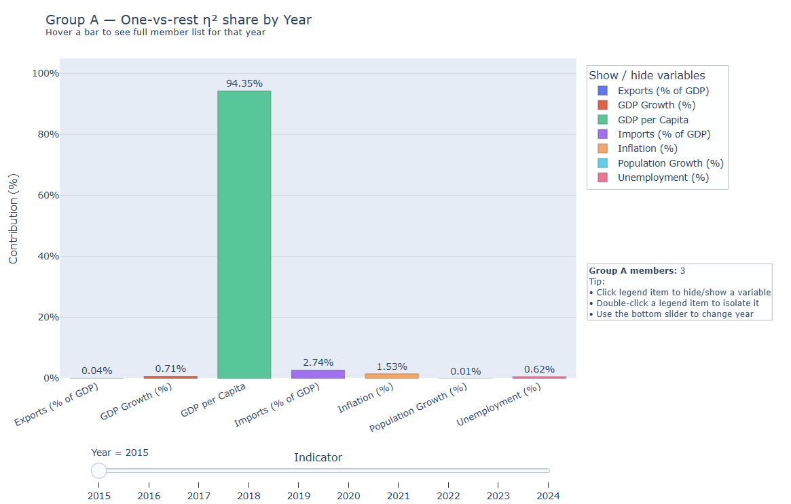

# Group B

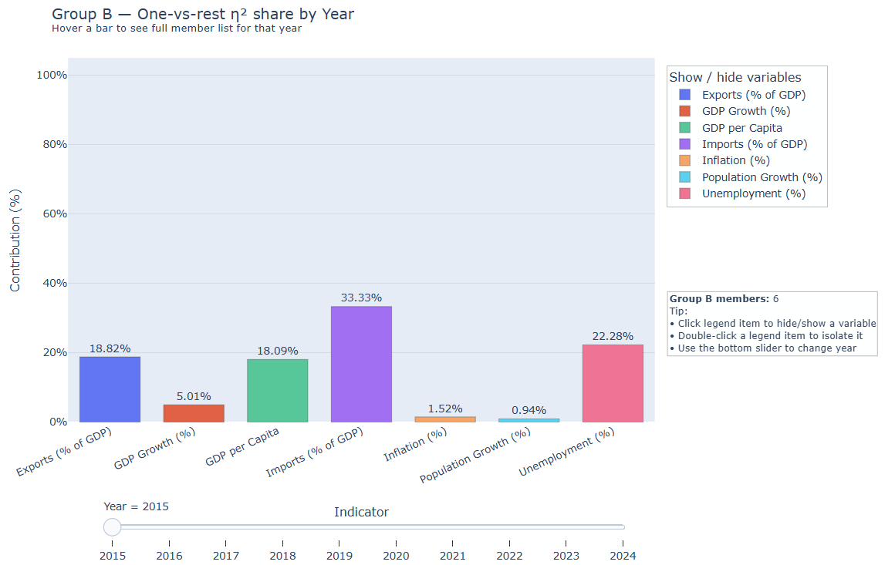

# Group C

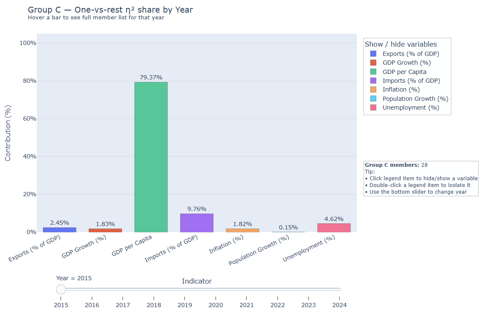

# Country level

### Visual encoding

- **One polyline per indicator** (legend colors).
- **X-axis:** Year; **Y-axis:** Share from positive Δη² in that year (%).
- **Gaps** in a line = indicator missing or no positive contribution that year (no imputation)

### Interactions

- **Country dropdown (top-left):** switch the profiled country.
- **Legend (top-right):** click to hide/show indicators; double-click to isolate one.
- **Hover a point:** shows Year, the **normalized share %**, the country’s **raw indicator value**, its **group label** that year, and the **signed Δη²** (so you can see if the unnormalized effect was negative).

## How to use it (quick workflow)

1. **Pick a country** from the dropdown.
2. **Scan peaks**: the tallest line(s) in a year are the **dominant drivers** of this country’s group separation then.
3. **Trace trajectories** to see how the **driver mix changes over time** (e.g., Imports ↓ while Population Growth ↑).
4. **Toggle lines** in the legend to focus on a subset (prices, trade, labor).
5. **Hover** to verify exact % share, the **raw value**, and whether the underlying Δη² was positive/negative.

# Here's one wrong visualization using the Z-score:

as we can see, the country American Samoa in 2015, the Imports contributes 26.92% using the Z-score contribution, however, the correct one is 68.75%. Which is a huge discrepancy. So i made this algorithm change to the contribution with direction, using the Country-level marginal contribution via leave-one-out $\eta^2$. 

---

## 2.6 Findings enabled by the visuals

### 1. Group level

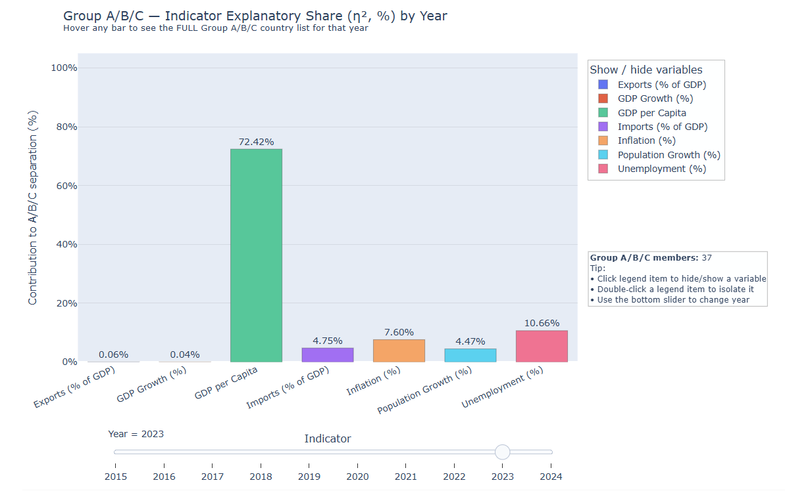

From 2015 to 2023, GDP per capita takes a very import role to grouping, seen as a crucial variable to separate countries into different groups. The average percentage from 2015-2023 is around 80%, however, in 2024, it changed radically. 

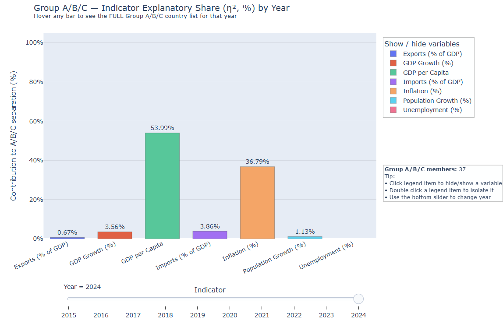

GDP per capita decrease to 53.99%, and the inflation increase from less than 10% to 36.79%, making over 20 countries shift from Group C to Group B. Which might illustrate the economic shifting or trend in post pandemic era. These countries all faced a structure problem or in another world economic recession when develop their economics. 

There are more interesting details, for example in Group A:

For this Group, the effective variables are between GDP Growth, GDP per Capita, Inflation and unemployment. The change is always happen within these 4 factors. 

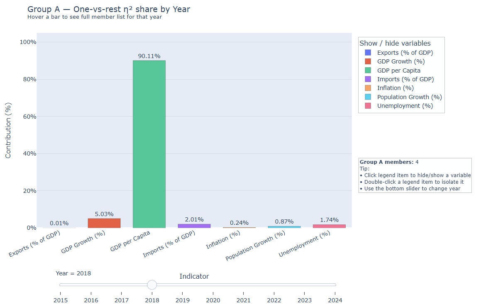

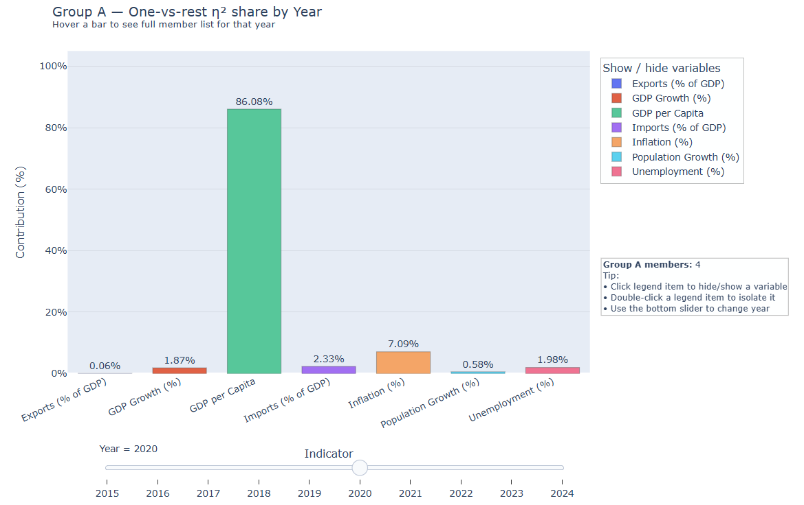

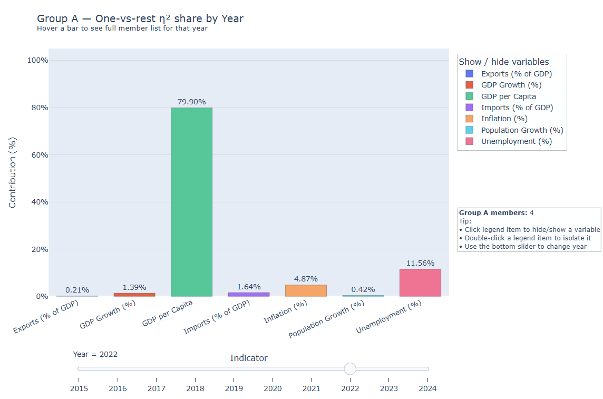

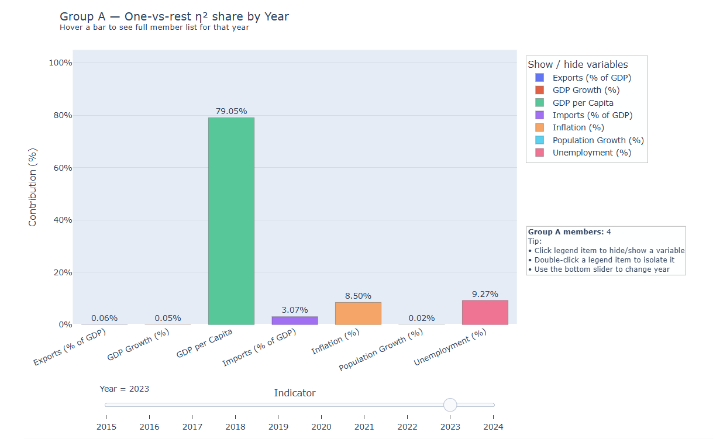

Things are totally different for Group B, each variable plays a relatively equal role for grouping. 2015 there are 6 members in Group B, however,  in 2023, there are 8 countries , and in 2024, there are even 31 countries. In our research, it means a decay of economics. It can be explained that after pandemic, each country falls into a different extent of recession. The economic problem burst out and culminated during 2023-2024.

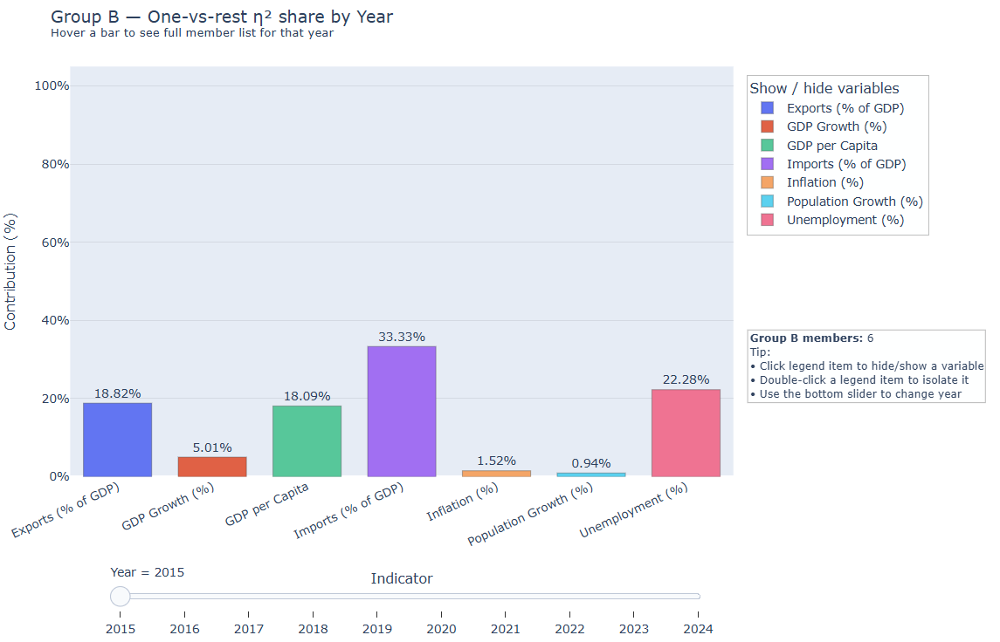

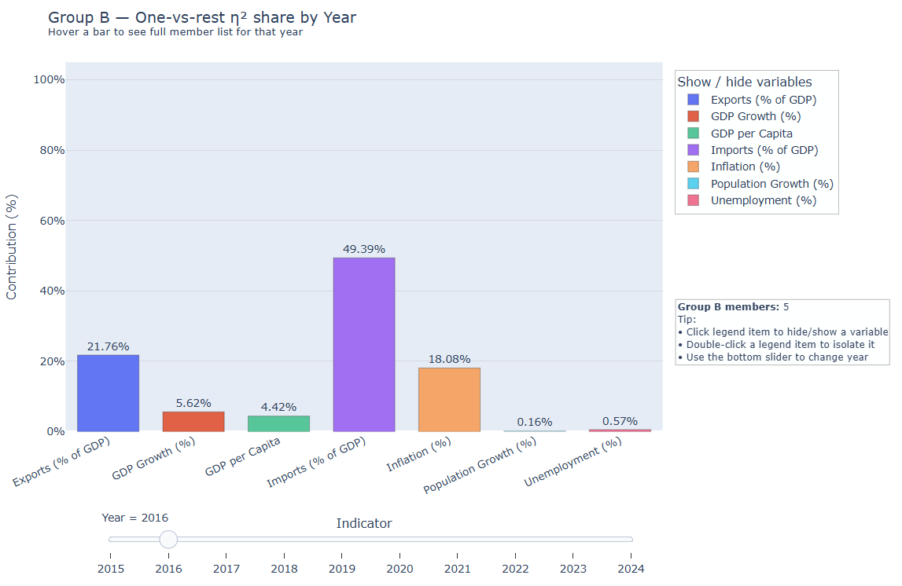

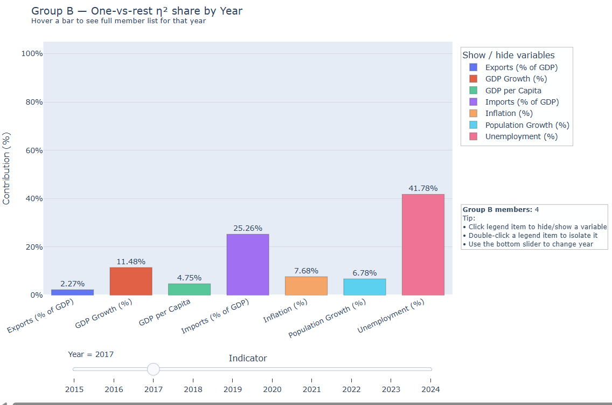

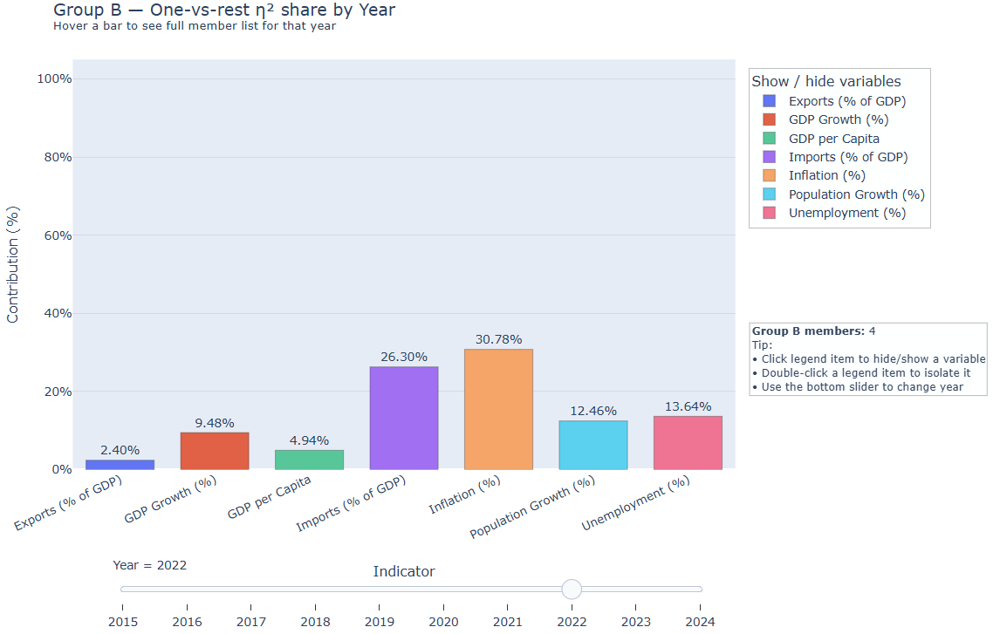

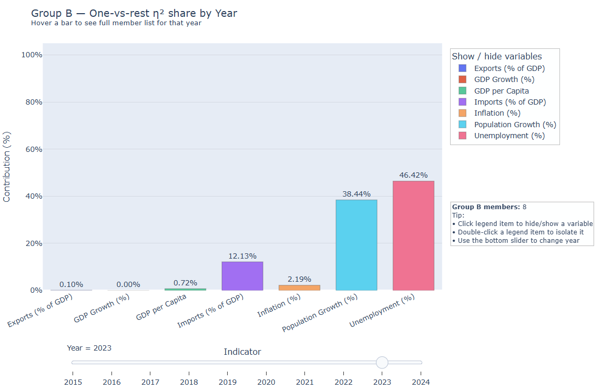

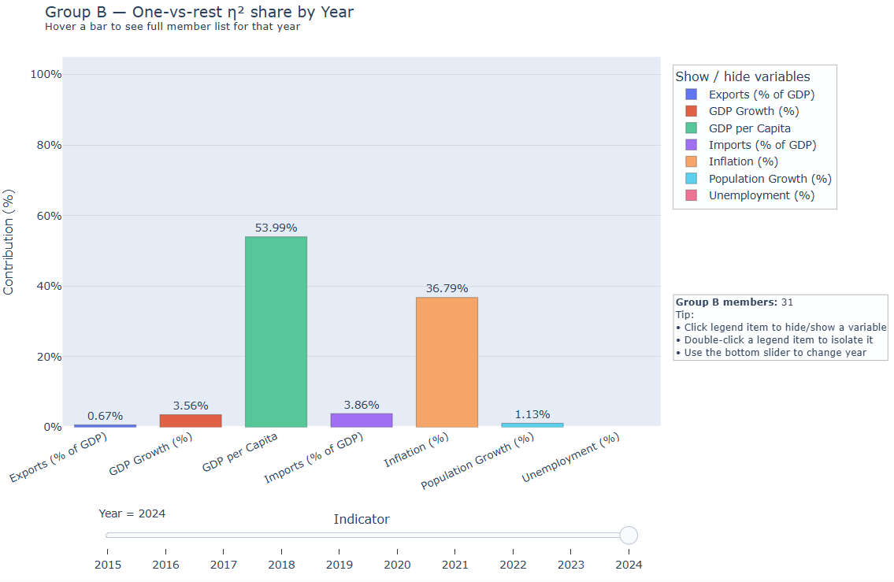

### 2. Country level

There are some interesting discoveries during the country level. For example, during 2024 in Japan, all of the variables made the negative contribution to the Group in 2024. Although for each variable made the negative contribution if counts respectively, it is still Grouped into Group C by the collaborative work of every variable.  

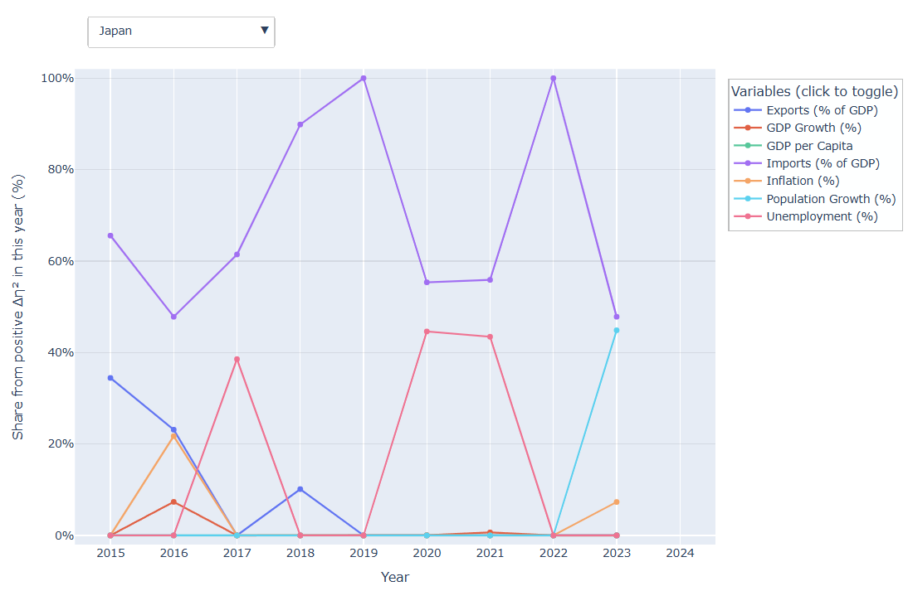

Another interesting country is Lao, it changed from group B to Group A in 2016, and changed from Group A to Group C in 2024. From 2015 to 2016, there is an obvious change for Exports, GDP growth, Imports and Population Growth, making Lao from Group B to Group A. In 2024, Inflation, GDP per capita, population growth, GDP growth made the joint effort to Group C. In this case, it can be inferred that for each variable, it can play roles for grouping. The joint effort decide how it is defined into groups. 

---

## 2.7 Limitations, ethics, and future work

- **Association, not causation.** $\eta^2$ quantifies association between group labels and indicator values; it does not imply that changing an indicator would cause a group change. I explicitly communicated this with an explainer panel (Fig. **[INSERT]**).
- **No imputation.** Per task constraints, we do not fill missing values. This makes attribution conservative; gaps indicate insufficient data rather than interpolated artefacts.
- **Aggregation sensitivity.** Group means and group sizes both affect $\eta^2$. In future work we could add robust effect sizes (e.g., ANOVA on ranks) or stratified analyses by region/income to test stability.
- **What-if tooling.** The LOO engine can be extended into an interactive counterfactual slider that perturbs a country’s indicator and recomputes $\eta^2$ to simulate minimal changes needed to maintain group membership, directly addressing the “critical moment/what-if” requirement.

---

## 2.8 Reproducibility and mapping to the group report

**Reproduce.** Run the two notebooks:  
(i) Group-level $\eta^2$ bar chart by year (code block starting at `eta_squared_for_year`);  
(ii) Country-level LOO lines (code block starting at `_eta2_from_stats` / `loo_eta2_contrib_one_panel`). No random seeds are involved; results are deterministic given the CSV.

# task2

# 2. Temporal Analysis

## 2.A Group A — Temporal Analysis

### 2.A.1 Membership dynamics over time

**What we see.**
 From **2015** to **2024**, Group A ranges between **0** and **4** members (mean **3.50**). The largest year-to-year change occurs in **2023→2024**, when **−4** countries left Group A simultaneously. Earlier, **2015→2016** shows a small inflow (**+1**) as Lao PDR moved into A.

- **Key flows (A ↔ B/C).**
  - **Lao PDR**: **B→A** in **2016**; **A→C** in **2024**.
  - **Indonesia**: **A→C** in **2024** (A from 2015–2023).
  - **Korea, Rep.**: **A→B** in **2024** (A from 2015–2023).
  - **Viet Nam**: **A→C** in **2024** (A from 2015–2023).
  - **Long-term stayers before 2024**: **Indonesia, Korea (Rep.), Viet Nam** remained in A throughout **2015–2023**.

**Evidence.**

- *[Insert Fig A-1: Membership flows]* An alluvial/sankey showing A↔B/C transitions (2015→…→2024).
- *[Insert Table A-1: Transition counts]* Cross-year transition matrix; entries into A: **B→A = 1**, **C→A = 0**; exits from A: **A→B = 1**, **A→C = 3**.

------

### 2.A.2 Attribute-combination dynamics (what defines Group A each year)

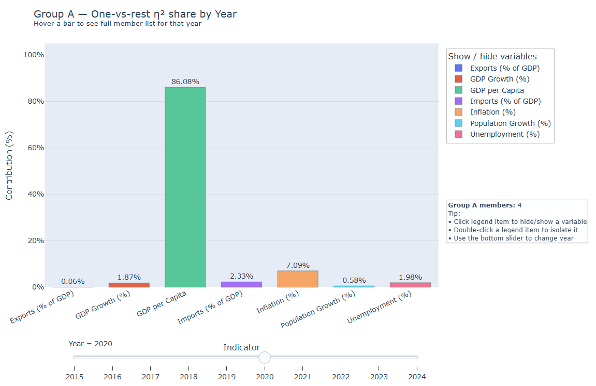

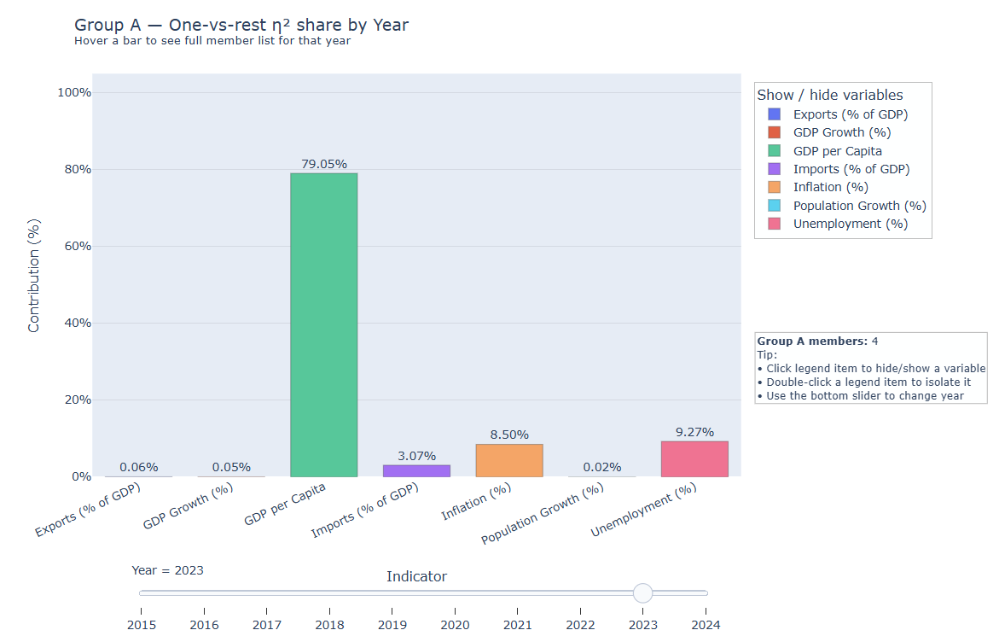

**Headline pattern.**  
Across the observable years for Group A, **GDP per Capita** is the dominant separator versus the rest, but its dominance eases over time while **Inflation** becomes more material. By **2024** Group A has **no members**; at the system level the separation pattern pivots toward price dynamics (see Group-C context below).

### 2015
- **Top driver:** GDP per Capita — **94.35%**  
- **Next:** Imports — **2.74%**, Inflation — **1.53%**  
- **Top-3 cumulative:** **98.62%**

### 2020
- **GDP per Capita:** **86.08%**
- **Next:** Inflation — **7.09%**, Imports — **2.33%**
- **Others:** Unemployment **1.98%**, GDP Growth **1.87%**, Population Growth **0.58%**, Exports **0.06%**
- **Top-3 cumulative:** **95.50%**

### 2023
- **GDP per Capita:** **79.05%**
- **Unemployment:** **9.27%**
- **Inflation:** **8.50%**
- **Then:** Imports — **3.07%**; others ≈ **0%**
- **Top-3 cumulative:** **96.82%**  
  *Change note:* **Unemployment** re-enters the Top-2, displacing **Imports**; exceeds our “Top-k replacement” rule.

### 2024
- **Status:** Group A dissolves (**0 members**).
- **Overall partition (one-vs-rest mix):** For the group that absorbs former A-members (**Group C** in 2024), shares are:  
  GDP per Capita **53.99%**, Inflation **36.79%**, Imports **3.86%**, GDP Growth **3.56%**.  
  *Interpretation:* evidence of a pivot from **income level** to **inflation pressure** in explaining the boundaries between groups.

This is the high level conclusion between Groups, with mathematics proves in it. However, if just analysis the four countries relevant to Group A, for each country, the dominant factor is not all the same, for example, Lao PDR changed from A -> C, the dominant factor is inflation, accounts for 74.19% with GDP per Capita 14.62%, population growth 9.14%, GDP growth 2.05%. 

Another example is Indonesia, with 56.03% GDP per Capita and 43.76% Exports in 2023 in Group A, but in 2024, with 60.23% GDP per Capita and 27.81% Exports and small percentages of other variables, it belongs to Group C.

Vitem Nan is a quite different situation

In 2023, the dominant factor is unemployment, with another variables contribute to even a negative figure to Group A, however, in 2024, it shifts to Group C with dominant factor GDP growth. 

​		

​		For the last country of Group A is Korea rep.

​		

​		during the time belongs to Group A, the GDP per Capita makes the great influence. When in 2024, it changes to Group C, inflation takes the biggest change. 

These results indicates that, while income level separates groups most years, **price instability in 2024** contributed substantially to re-arranging memberships (see §2.A.3).

- **Top-k over time (illustrative).**
  - **2015:** Top-3 = *GDP per Capita, Imports, Inflation* → **98.62%**.
  - **2020:** Top-3 = *GDP per Capita, Inflation, Imports* → **95.50%**.
  - **2023:** Top-3 = *GDP per Capita, Unemployment, Inflation* → **96.82%**.
  - **2024 (context):** *GDP per Capita, Inflation, Imports* in the absorbing group (Group C) → **94.64%**.

------

### 2.A.3 Linking member changes to attribute changes (country-level mechanism)

Below we connect **group changes** to **indicator mechanisms** using leave-one-out (LOO) Δη² analysis. For a country iii in year ttt, the signed Δη² measures how much the **between-group separability** (η²) would **drop or increase** if we remove that country. We also report the **positive share** of Δη² (normalized to 100% across the seven indicators in that country-year).

> Hover the 7-line plot in the app to see each year’s positive share and signed Δη²; negative signed Δη² indicates the indicator **counteracts** separation for that country-year.

#### Case A-α — **Lao PDR, 2015→2016 (B→A)**

- **Membership change.** Moved **B→A** in **2016**.
- **Group-level shift.** Top-2 indicator shares remained **income-led** (2015: GDPpc **84.96%**, 2016: GDPpc **76.79%**) but **Unemployment** stayed a secondary separator (2016: **9.98%**).
- **LOO mechanism (country-level).**
  - **2015 (in B)**: Positive contributions concentrated in **Imports (55.0%)** and **Population Growth (39.3%)**; **GDP per Capita** had **negative** signed Δη² (−0.022), meaning Lao PDR’s income level **reduced** separability that year.
  - **2016 (in A)**: Mix shifts to **GDP Growth (38.9%)**, **Population Growth (31.9%)**, **Inflation (27.9%)**; GDPpc remains slightly negative (−0.003), but **growth/price dynamics** now align more with A’s separating pattern.
- **Interpretation.** Lao PDR’s move into A is explained less by absolute income and more by a **profile shift in macro dynamics** (growth/price/population) that better matches A’s defining combination in 2016.

------

#### Case A-β — **Indonesia, 2023→2024 (A→C)**

- **Membership change.** Moved **A→C** in **2024**.
- **Group-level shift.** **Inflation**’s η² share jumps from **7.60% (2023)** to **36.79% (2024)** while GDPpc falls to **53.99%** (from **72.42%**).
- **LOO mechanism (country-level).**
  - **2023 (in A)**: Positive shares led by **Exports (44.5%)**, **Unemployment (25.7%)**, **GDPpc (11.6%)**.
  - **2024 (in C)**: Mix flips to **Population Growth (44.8%)** and **GDPpc (42.8%)** as top positives; **Inflation** receives **0% positive share** with a small **negative signed Δη² (−0.001)**, i.e., Indonesia’s inflation level in 2024 **does not support** the new separation that inflation drives globally.
- **Interpretation.** As inflation becomes a key separator in 2024, Indonesia’s own inflation positioning **misaligns** with the A-defining pattern, contributing to the **exit from A**.

------

#### Case A-γ — **Korea, Rep., 2023→2024 (A→B)**

- **Membership change.** Moved **A→B** in **2024**.
- **Group-level shift.** Same pivot as above (Inflation rises to **36.79%** in 2024).
- **LOO mechanism (country-level).**
  - **2023 (in A)**: **GDPpc** dominates Korea’s positive share (**64.5%**), consistent with A’s income-led separation.
  - **2024 (in B)**: **Population Growth** now dominates (**83.5%**), while **Inflation** contributes **0%** with **negative** signed Δη² (−0.003).
- **Interpretation.** Korea’s 2024 profile emphasizes **demographics, not inflation**, so as inflation becomes globally discriminative, Korea’s fit shifts closer to **B**.

------

#### Case A-δ — **Viet Nam, 2023→2024 (A→C)**

- **Membership change.** Moved **A→C** in **2024**.
- **LOO mechanism (country-level).**
  - **2023 (in A)**: Positive shares split across **Exports (33.9%)** and **GDPpc (31.9%)**.
  - **2024 (in C)**: **GDPpc (59.5%)** and **Exports (22.7%)** remain positive; **Inflation** stays at **0%** with **negative** signed Δη² (−0.003).
- **Interpretation.** As with Indonesia, **insufficient alignment on inflation** in 2024 coincides with Viet Nam’s **exit from A**.

### 2.A.4 Summary for Group A

##### 1. Stable vs. volatile phases

- **2015:** 3 members  
- **2016:** expands to **4** (net **+1**)  
- **2017–2023:** stable at **4**  
- **2024:** **dissolves to 0** (net **−4**)  
- **Pattern:** long stable phase → abrupt dissolution.

##### 2. Defining attributes

- **2015 → 2023:** **GDP per Capita** is the principal separator (**≈79–94%** $\eta^2$, year-dependent).  
- **Secondary drivers rotate:**
  - **2015:** Imports / Inflation
  - **2020:** Inflation takes the #2 slot
  - **2023:** Unemployment enters the Top-2
- **2024 (system-level pivot):** Overall partition shifts toward **Inflation**. In Group C (which absorbs former A members), one-vs-rest shares are **53.99%** GDP per Capita vs **36.79%** Inflation — consistent with A’s dissolution.

##### 3. Mechanism *(link to §2.A.3)*
- **LOO profiles (country-level):** Entries into A during the stable phase align with **high GDP per Capita** (income-led separation).  
- **2024 exits:** As **Inflation** becomes system-wide discriminative, former A members no longer match the prior *income-led* signature.  
- **Action for report:** Insert per-country LOO panels for movers to show which indicators **flipped sign** or **surged in share**.

------

## 2.B Group B — Temporal Analysis

### 2.B.1 Membership dynamics over time

**What we see.**
 From **2015** to **2024**, Group B ranges between **4** and **31** members (mean **10.1**). The sharpest year-to-year change is **2023→2024** with a **+23** net **gain** in members (from 8 to 31).

- **Key flows.**

  **Out of B → other groups**

  - **2016:** **Lao PDR** (**B→A**).
  - **2017:** **New Caledonia** (**B→C**).
  - **2024:** **Cambodia**, **Japan**, **Mongolia** (**B→C**).

  **Into B from other groups**

  - **2023:** **American Samoa**, **Guam**, **New Caledonia**, **Northern Mariana Islands** (**C→B**, except New Caledonia **C→B** returning after 2017 exit).
  - **2024:** **Australia**, **Brunei Darussalam**, **China**, **Fiji**, **French Polynesia**, **Hong Kong SAR, China**, **Kiribati**, **Korea, Rep.**, **Macao SAR, China**, **Malaysia**, **Marshall Islands**, **Micronesia, Fed. Sts.**, **Myanmar**, **Nauru**, **New Zealand**, **Palau**, **Papua New Guinea**, **Philippines**, **Samoa**, **Singapore**, **Solomon Islands**, **Thailand**, **Timor-Leste**, **Tonga**, **Tuvalu**, **Vanuatu** (**A/C→B**).

  **Long-tenure members.**

  - **Dem. People’s Rep. of Korea (DPRK)** remained in **B for the entire 2015–2024** window.
  - **Cambodia, Japan, Mongolia** stayed in **B** for **2015–2023** before moving to **C** in **2024**.

**Evidence.**

- **Fig. B-1 (Membership flows)** — Alluvial/Sankey of B↔A/C transitions, 2015–2024. *(Insert Fig. B-1 here)*
- **Table B-1 (Transition counts)** — t→t+1 move counts into/out of B. *(Insert Table B-1 here)*

------

### 2.B.2 Attribute-combination dynamics

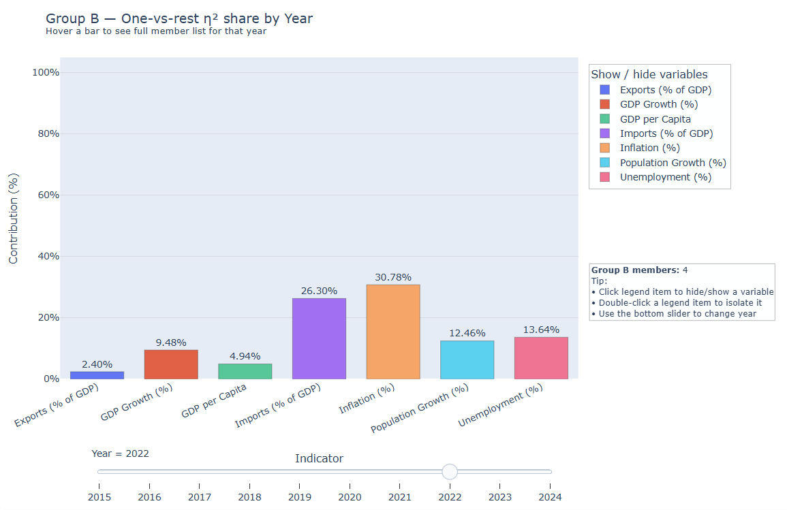

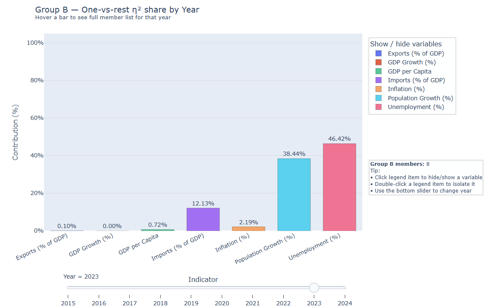

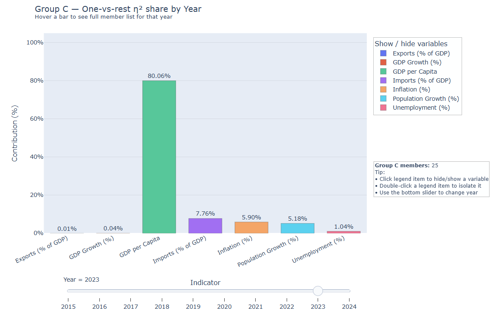

**Headline pattern.**  
Unlike Group A, **Group B’s separability rotates across indicators**. Early years are led by **Imports** and **Unemployment**; the mid-period flips to **GDP Growth / Inflation**; **2023** is dominated by **labour/demographics** (*Unemployment + Population Growth*); **2024** pivots sharply to **Income + Prices** (*GDP per Capita + Inflation*).

### Year-by-year
- **2015:** Imports **33.33%**, Unemployment **22.28%**, Exports **18.82%**; GDP per Capita close but lower (**18.09%**).
- **2018:** GDP Growth **53.37%**, Inflation **22.28%**, Imports **14.96%**.
- **2020:** Unemployment **40.77%**, Inflation **26.72%**, Imports **22.75%**.
- **2022:** Inflation **30.78%**, Imports **26.30%**, Unemployment **13.64%** *(Population Growth **12.46%**)*.
- **2023:** Unemployment **46.42%**, Population Growth **38.44%**, Imports **12.13%**.
- **2024:** GDP per Capita **53.99%**, Inflation **36.79%**, Imports **3.86%**; others ≤ **3.56%**.

### Dominance shift
From **2023 → 2024** the center of gravity moves from **labour/demographics** to **income/price** dynamics:
- Unemployment **46.42% → ~0%**  
- Population Growth **38.44% → 1.13%**  
- GDP per Capita **0.72% → 53.99%**  
- Inflation **2.19% → 36.79%**  
This easily exceeds the “change” rule (≥30% relative move for a top indicator).

### Top-k sequence *(k = 3)*
- **2015:** {Imports, Unemployment, Exports} — cumulative $\eta^2$ **74.43%**.  
- **2020:** {Unemployment, Inflation, Imports} — cumulative $\eta^2$ **90.24%**.  
- **2024:** {GDP per Capita, Inflation, Imports} — cumulative $\eta^2$ **94.64%** *(clear pivot toward income/price).*  

------

### 2.B.3 Linking member changes to attribute changes (country-level mechanism)

Below, for each country we report the **LOO share** of positive Δη² (within-year shares sum to 100%), plus the **signed Δη²** signal (positive=helps separation, negative=hampers).

**==这里的case补充一个整体的那么多国家的整体shift==Case B-β — American Samoa, 2022→2023 (C→B).**

- **Membership change.** **Entered B** in **2023**.
- **Group-level shift.** Group-level **Population Growth** share rises (23.32% in 2023’s Top-3).
- **LOO mechanism.** American Samoa’s **Population Growth** LOO share **65.01%→100.00%**, with **signed Δη²** **0.0039→0.0286** (stronger positive contribution).
- **Interpretation.** The country’s profile becomes **fully aligned** with the between-group signal driven by **Population Growth** in 2023, consistent with its **C→B** move.

**Case B-γ — Lao PDR, 2015→2016 (B→A).**

- **Membership change.** **Left B → A** in **2016**.
- **Group-level shift.** In early years, separability is dominated by **GDP per Capita**; by 2016, **Imports** gains weight at the margin.
- **LOO mechanism.** Lao PDR’s profile shifts from **2015:** **GDP Growth 48.47%**, **Exports 33.85%**, to **2016:** **Imports 38.42%**, **Population Growth 15.90%** (Inflation shrinks to **0%**).
- **Interpretation.** The country’s **indicator mix moves away from the “GDP-centric” B-alignment** toward an **A-consistent** pattern; exit from B is thus expected.

**Case B-δ — New Caledonia, 2016→2017 (B→C), then 2022→2023 (C→B).**

- **Membership change.** **B→C** in **2017**, **re-enters B** in **2023**.
- **LOO mechanism (2016→2017).** 2016 is a **trade-mix** year (Exports **14.27%**, Imports **9.81%**, Inflation **5.95%**), but **2017** turns sharply to **Unemployment (90.63%)**, which **no longer supports** the then dominant group-level separation — hence **B→C**.
- **Return (2022→2023).** Group-level **Population Growth** rises in 2023; New Caledonia’s LOO mix re-aligns with the B-defining factors and it **rejoins B**.

**Case B-ε — Cambodia, 2023→2024 (B→C).**

- **Membership change.** **Left B → C** in **2024**.
- **Group-level shift.** 2024 **Inflation** becomes a **core driver** of between-group separation (**36.79%**), while GDP per Capita falls.
- **LOO mechanism.** Cambodia’s driver flips from **Inflation (100% of positive Δη² in 2023)** to a **growth-population mix** in 2024 (**GDP Growth 75.10%**, **Population Growth 24.90%**).
- **Interpretation.** The country becomes **less consistent** with **B’s 2024 “Inflation-heavy”** composition and drifts into **C**.

------

## 2.B.4 Summary for Group B

### Stability
- **2017–2022:** small and steady — size **= 4** each year  
- **2023:** expands to **8**  
- **2024:** surges to **31** (**net +23**)

### Defining attributes
- **2015:** separation led by **Imports** and **Unemployment**.  
- **2018–2020:** turns toward **GDP Growth / Inflation / Unemployment**.  
- **2022:** **Inflation + Imports**.  
- **2023:** **Unemployment + Population Growth** dominate (≈ **85%** combined).  
- **2024:** decisive pivot to **GDP per Capita (53.99%)** and **Inflation (36.79%)**.

### Mechanism
- **Entrants** tend to align with the then-dominant signals in the **LOO** profiles (e.g., *American Samoa* in **2023** lines up with the labour/demographic pattern).  
- **Major exits in 2024** — *Cambodia, Japan, Mongolia*, etc. — coincide with the switch toward **income/price** separation, as their country-level profiles diverge from Group B’s new mix.

### Top-k recap *(k = 3)*
- **2015:** {Imports, Unemployment, Exports} — **74.43%** (cumulative $\eta^2$).  
- **2020:** {Unemployment, Inflation, Imports} — **90.24%** (cumulative $\eta^2$).  
- **2024:** {GDP per Capita, Inflation, Imports} — **94.64%** → pivot to **Inflation + income level**.

# task3

