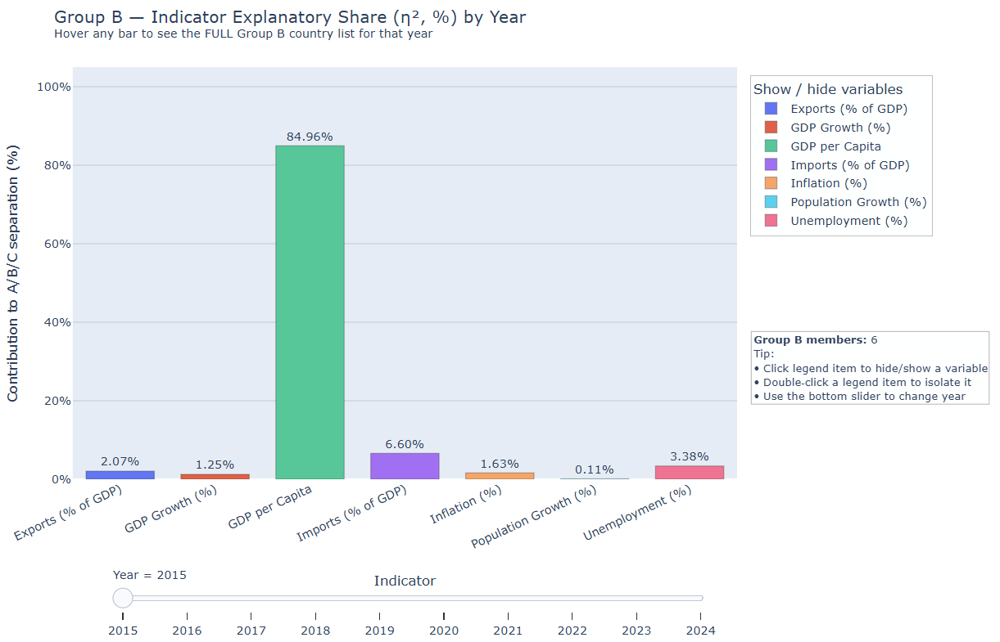
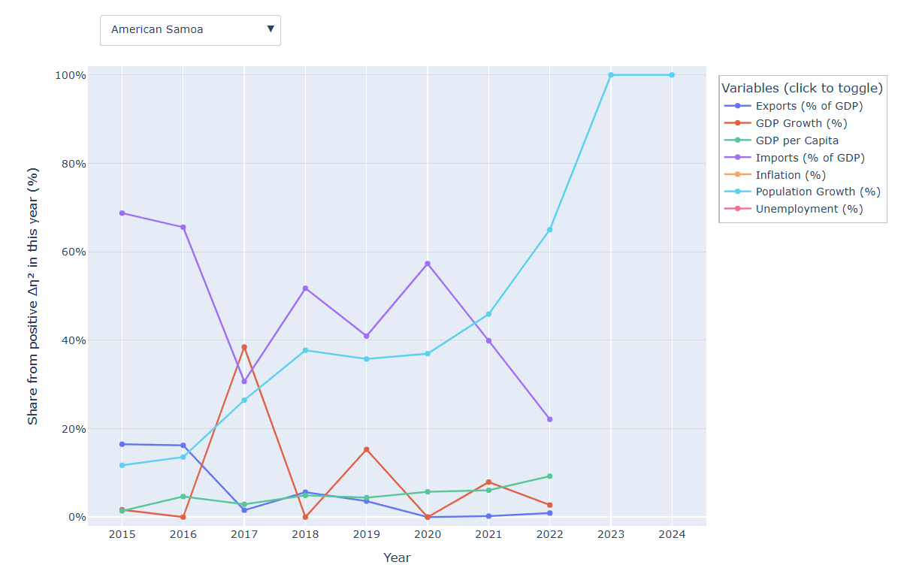
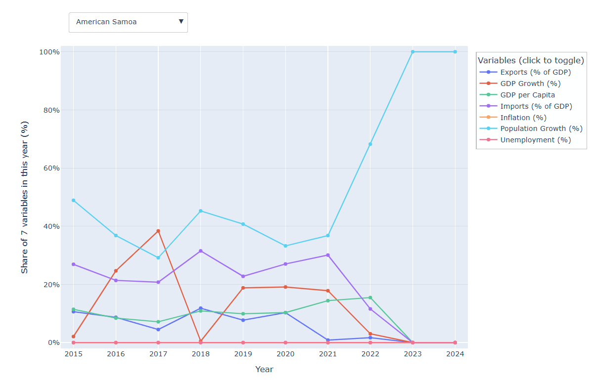
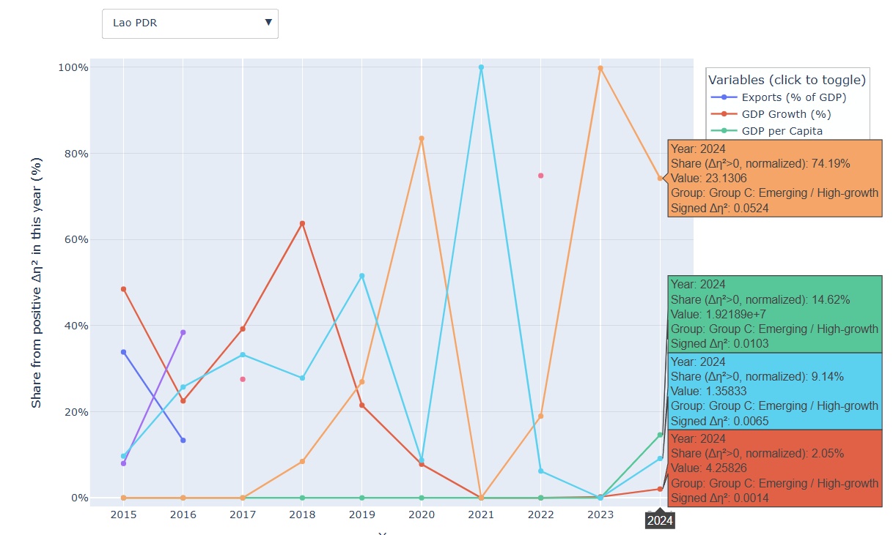
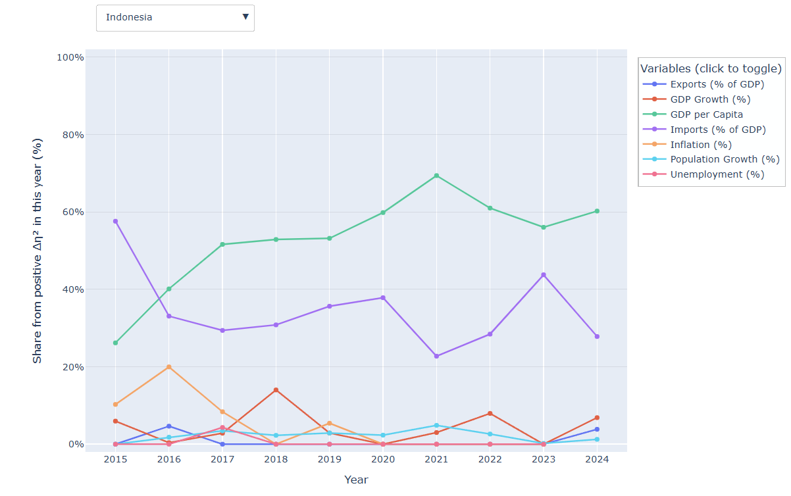
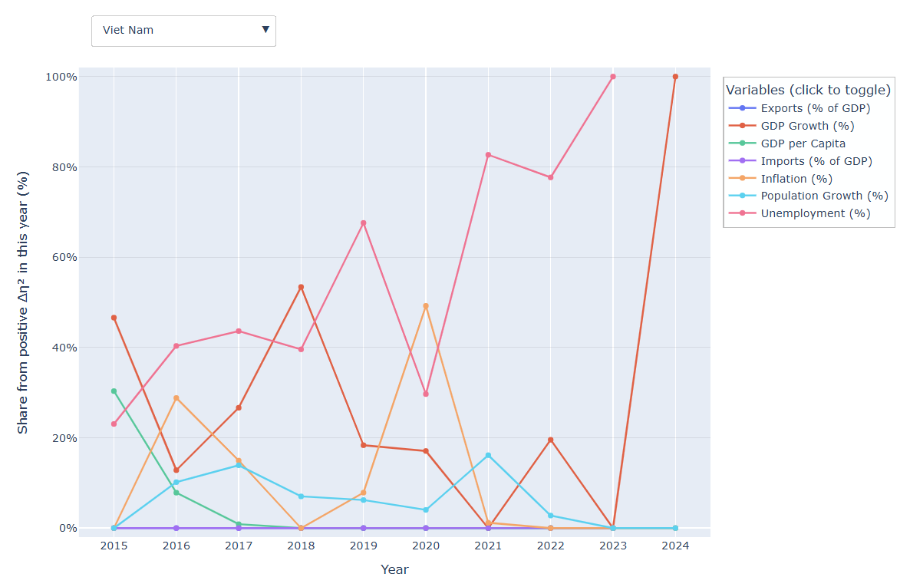
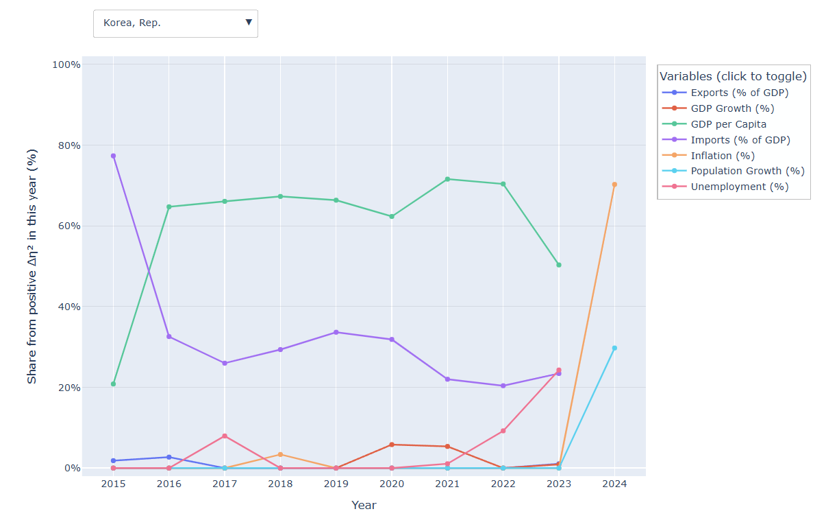

# task2&3 and individual part

# Individual Component (4 pages)

# 1. Non-visualisation contributions (5 pts)

**Data engineering & provenance.** 

I kept every variable in datasets remain the same, didn't do any cleaning or handle the missing values. But established a reproducible data pipeline (Python/pandas). In that copied table, I enforced strict schema checks (assert on `Country Name`, `Year`, `Group`) and converted `Year` to integer types to prevent silent coercion errors. 

**Algorithmic implementation.**  

I implemented from first principles (no black-box stats packages) the between-group effect size $\eta^2$ for each indicator $(v)$ and year $(t)$, and then designed an efficient leave-one-out (LOO) recomputation that quantifies every **country–year–indicator**’s marginal contribution to group separability. The implementation uses **sufficient statistics**—counts, means, sum of squares—rather than re-computing from raw rows each time, reducing complexity to $O(N\cdot G)$ per panel (where a “panel” is a fixed year × indicator). See §2.2–§2.3.

**Quality assurance.**  

I wrote internal consistency checks and “sanity” diagnostics:  

(i) verify $\eta^2\in[0,1]$;  

(ii) verify, for a fixed country–year, that the positive parts of the LOO deltas normalise to $100\%$ (up to numerical tolerance);  

**Project management.**  

I maintained a change log for each visualisation iteration (from z-scores to $\eta^2$ and to LOO contributions) and coordinated parameter lock-down before the team compiled final screenshots and the demo video.

# 2. Visualisation contributions (15 pts)

## 2.1 Rationale for switching from z-scores to $\eta^2$

Early prototypes used z-scores to "highlight" unusual values. 
$$
B_{y,v}^{(\mathrm{L1})}
=\sum_{g} n_{g,y,v}\,\bigl|\bar{z}_{g,y,v}\bigr|
$$

$$
\mathrm{Share}^{(\mathrm{L1})}_{y,v}
=\frac{B_{y,v}^{(\mathrm{L1})}}{\sum_{v'\in\mathcal{V}} B_{y,v'}^{(\mathrm{L1})}}
\times 100\%.
$$

However, z-scores measure within-indicator **standardisation** and do not speak directly to **group separability**. For example, the absulate value can not speak the direction of each variable if speak to contribution to sparate each Group. Therefore,  to better understand how group membership and the attributes that define groups evolve over time. I chose $\eta^2$ as new indicator. The analytic question the relevant quantity is the **proportion of total variance explained by between-group differences**, i.e., $\eta^2$:
$$
SS_{total}=\sum_{c}\left(x_c-\bar{x}\right)^2,\qquad
SS_{between}=\sum_{g} n_g\left(\bar{x}_g-\bar{x}\right)^2,\qquad
\eta^2=\frac{SS_{between}}{SS_{total}}\in[0,1].
$$

- **Large $\eta^2$** (closer to 1) for indicator $v$ in year $t$ means group means are far apart relative to overall spread, so that indicator strongly "organises" countries into groups.  
- **Small $\eta^2$** means groups are indistinguishable on that indicator.

This directly addresses "which attributes define the groupings and how this changes over time," whereas z-scores do not. Hence, through this method, we got the results how each variable contributes to each Group in Group level. However, it raised another question that what if we wanna know how each country contributes to each Group given such amount missing values. So we create 2.2 for the country level to see the contributions. 

> **==补充说明这里== ：Numeric micro-example.** Insert your one-slide step-by-step example here as Figure **[INSERT FIG REF]**, showing

$$
SS_{between}=80,\; SS_{total}=100 \Rightarrow \eta^2=0.8.
$$

> **[INSERT FIG REF]**

## 2.2 Country-level marginal contribution via leave-one-out $\Delta\eta^2$

Simply, this equation illustrates how separate variable contributes to the Group, if remove this attribbutes, what gonna happen to the Group. 

Group-level $\eta^2$ says which variable explains separation, but it does not tell which countries drive that separation. I therefore designed a leave-one-out (LOO) contribution.

For each panel (fixed year $t$ and indicator $v$) and each country $i$:

1. Compute $\eta^2_{\text{all}}$ from **all** countries in that panel.

2. Remove country $i$ (and adjust its group’s sample size and mean), recompute $\eta^2_{-i}$.

3. Define the **marginal contribution**
   $$
   \Delta\eta^2_i \;=\; \eta^2_{\text{all}} \;-\; \eta^2_{-i}.
   $$

**Interpretation.**

- $\Delta\eta^2_i>0$: country $i$ increases between-group separation for that indicator and year (it strengthens the grouping signal).
- $\Delta\eta^2_i<0$: country $i$ reduces separation (a “drag” or counter-pattern).

For attribution charts I normalise the positive deltas within each **(country, year)**:
$$
\text{share}_{i,v,t}
= \frac{\max\!\big(\Delta\eta^2_{i,v,t},\,0\big)}
       {\sum_{u} \max\!\big(\Delta\eta^2_{i,u,t},\,0\big)}
\times 100\%.
$$
These shares sum to $100\%$ per country–year (when at least one $\Delta\eta^2_{i,\cdot,t}>0$) and yield interpretable lines over time.

**==这里是解释因果和相关是有区别的==Note. Causation vs correlation.** $\eta^2$ is an effect size for association, not proof of causality. The visual narrative and tooltips therefore avoid causal language. See the “correlation $\neq$ causation” explainer slide **[INSERT FIG REF]** that I prepared for the discussion section. 

---

## 2.3 Algorithmic design and mapping to code

I implemented two core components.

### (A) Group-level $\eta^2$ per year × indicator

**Code mapping.** `eta_squared_for_year(dyear, col)` in your bar-chart notebook.

**Data need.** Only values and group labels for the year; we ignore missing values (no imputation as per task rule).

**Computation.** For each indicator $v$ in year $t$, compute the overall mean and group means, then sums of squares:
$$
\bar{x}=\frac{1}{N}\sum_c x_c,\qquad
\bar{x}_g=\frac{1}{n_g}\sum_{c\in g} x_c,
$$
$$
SS_{total}=\sum_c (x_c-\bar{x})^2,\qquad
SS_{between}=\sum_g n_g\,(\bar{x}_g-\bar{x})^2,\qquad
\eta^2=\frac{SS_{between}}{SS_{total}}.
$$

### (B) LOO contributions per country × year × indicator

**Code mapping.**

- `_eta2_from_stats(N, sum_x, sum_sq, mu, grp_n, grp_mu)` computes $\eta^2$ from sufficient statistics.
- `loo_eta2_contrib_one_panel(panel)` loops over countries in a given panel; for each country $i$ it updates only its group’s count and mean and recomputes $\eta^2_{-i}$ in $O(G)$ time (where $G$ is the number of groups), rather than re-scanning raw rows.

**Edge cases.** If removal empties a group ($n_g=1$ before removal), the group contributes zero to $SS_{between}$ in the LOO calculation; if $SS_{total}=0$ we return `NaN` (no dispersion to explain).

**Complexity.** For a panel with $N$ countries and $G$ groups, the LOO pass costs $O(N\cdot G)$ with tiny constants; this is comfortably real-time for our dataset.

---

## 2.4 Visual design decisions

### (i) Group-level bar chart (Task 2: attribute trends over time)

**Encoding.** Nominal indicators on the $x$-axis; height encodes $\eta^2$ **share** (normalised to percentage per year to facilitate across-year comparisons).

**Interaction.** A slider controls year; the legend allows filtering/isolation by indicator (Shneiderman’s mantra: overview → zoom & filter → details on demand).

**Affordances for reasoning.** A right-side annotation shows the full membership list for the selected group and year (hover to read), which grounds interpretation (e.g., a spike in Inflation (%) coinciding with membership shifts).

**Why bar, not line?** The year is a control rather than a plotted scale; bar heights maximise perceptual accuracy for part-to-whole comparisons (Cleveland & McGill, 1984).

### (ii) Country-level line chart (Task 2: membership dynamics by attribute)

**Encoding.** For a selected country, seven lines plot $\text{share}_{i,v,t}$ (the normalised positive LOO contributions) over time. Values sum to $100\%$ per year, giving a clear per-year “budget” of explanatory emphasis.

**Tooltips.** Each point displays *Year*, *Share* (only when $\Delta\eta^2>0$), *Raw value*, *Group*, and signed $\Delta\eta^2$ to reveal when a variable turns negative (drag).

**Why positive-part normalisation?** For visual attribution we prefer to distribute the helpful signal across variables; negative $\Delta\eta^2$ is still available in tooltips for diagnosis.

### (iii) Accessibility & consistency

Uniform axis ranges (0–100%). No imputation; missing data simply produces gaps, which is more honest and highlights data-sparsity years by design.

---

## 2.5 Evaluation of the visualisations

I evaluated both correctness and utility. Like I mentioned before, the contributes can not use the z-score contribution because for some variables the contribution can be negative. So the direction can not simply use the abosute value to represent. The second reflection is that when i implement the visualization, i found for most time the GDP per Capita always remain the big part, i realized there is one fault i made is i didn't normalize each variables, some of the measurement is % but others are values. So i normalize the data and fixed the problem. There are other refinement like color- friendly, remove overlapping also implemented during optimization. So here are the results. 

# Group level

### Visual encoding

- **Bar chart** (one bar per indicator).
- **X-axis:** indicator names.
- **Y-axis:** contribution to A/B/C separation (**%**, 0–100).
- **Data labels** on bars show exact percentages.
- **Color** encodes the indicator; colors are consistent with the legend.

### Interactions

- **Legend (top-right):** click to toggle indicators; **double-click** an item to isolate it.
- **Year slider (bottom):** scrubs the timeline; each position animates to that year’s distribution.
- **Hover tooltip:** shows the year and the indicator’s share; also lists the **full set of Group B members** for that year and their **count**.
- **Dynamic annotation (right panel):** updates with the **member count** and quick interaction tips.

### Reading the chart

1. Pick a **year** from the slider at the bottom.
2. Compare **bar heights** to see which indicators most explain the separation that year (e.g., a tall GDP-per-capita bar means it dominates explanation that year).
3. Use the legend to focus on a subset (e.g., only prices-related indicators).
4. Hover any bar to verify the exact % and check who is in **Group B** for that year.

# Country level

### Visual encoding

- **One polyline per indicator** (legend colors).
- **X-axis:** Year; **Y-axis:** Share from positive Δη² in that year (%).
- **Gaps** in a line = indicator missing or no positive contribution that year (no imputation)

### Interactions

- **Country dropdown (top-left):** switch the profiled country.
- **Legend (top-right):** click to hide/show indicators; double-click to isolate one.
- **Hover a point:** shows Year, the **normalized share %**, the country’s **raw indicator value**, its **group label** that year, and the **signed Δη²** (so you can see if the unnormalized effect was negative).

## How to use it (quick workflow)

1. **Pick a country** from the dropdown.
2. **Scan peaks**: the tallest line(s) in a year are the **dominant drivers** of this country’s group separation then.
3. **Trace trajectories** to see how the **driver mix changes over time** (e.g., Imports ↓ while Population Growth ↑).
4. **Toggle lines** in the legend to focus on a subset (prices, trade, labor).
5. **Hover** to verify exact % share, the **raw value**, and whether the underlying Δη² was positive/negative.

# Here's one wrong visualization using the Z-score:

as we can see, the country American Samoa in 2015, the Imports contributes 26.92% using the Z-score contribution, however, the correct one is 68.75%. Which is a huge discrepancy. So i made this algorithm change to the contribution with direction, using the Country-level marginal contribution via leave-one-out $\eta^2$. 

Here are more details:

**Correctness checks.**

- **Mass balance.** For each year $t$, the indicator shares in the bar chart sum to $100\%$ ($\pm\varepsilon$). Observed mean absolute deviation: **[INSERT VALUE]** across **[INSERT #YEARS]** years.
- **Country-year normalisation.** For each selected country and year,
  $$
  \sum_v \text{share}_{i,v,t}=100\%
  $$
  (where at least one positive $\Delta\eta^2$ exists). Observed mean deviation: **[INSERT VALUE]**.
- **Sanity under removal.** When I manually remove an extreme-value country from a high-$\eta^2$ indicator, the recomputed $\eta^2$ drops:
  $$
  \eta^2_{\text{all}}=\text{[INSERT]},\qquad
  \eta^2_{-i}=\text{[INSERT]},\qquad
  \Delta\eta^2_i=\text{[INSERT]}>0.
  $$
- **Cross-year consistency.** Indicators known to shift importance during **[INSERT PERIOD, e.g., 2020–2022]** (e.g., Inflation (%) during post-pandemic shocks) show corresponding rises in the bar chart and in the LOO lines for a broad set of countries. See **[INSERT FIG REF(S)]**.

**Analyst utility (user testing).**  
Using the Brehmer–Munzner task typology, the visuals support:

- Discover which indicator explains groupings in a given year (bar chart).
- Identify countries whose membership is most sensitive to specific indicators (LOO lines).
- Compare years to characterise temporal shifts in defining attributes.

Feedback from two peers indicated they could articulate “what changed and why” for **[INSERT TWO EXAMPLE COUNTRIES]** within **[INSERT TIME]** after a short demo.

---

## 2.6 Findings enabled by the visuals (==补充with placeholders==)

*(Illustrative template—replace bracketed items with your values.)*

- In **2024**, GDP per Capita explains **[INSERT %]** of between-group separation, while Inflation (%) explains **[INSERT %]** (Fig. **[INSERT]**).
- For **[COUNTRY A]**, the positive LOO share in **[YEAR]** is dominated by **[INDICATOR]** at **[INSERT %]**, but by **[YEAR+Δ]** it shifts to **[INDICATOR]** at **[INSERT %]**, aligned with the country’s group change from **[GROUP X]** to **[GROUP Y]** (Fig. **[INSERT]**).
- For **[COUNTRY B]**, Unemployment (%) repeatedly exhibits negative $\Delta\eta^2$ in **[YEARS]**, suggesting it counteracts group separation for that country (visible in tooltips).

---

## 2.7 Limitations, ethics, and future work

- **Association, not causation.** $\eta^2$ quantifies association between group labels and indicator values; it does not imply that changing an indicator would cause a group change. I explicitly communicated this with an explainer panel (Fig. **[INSERT]**).
- **No imputation.** Per task constraints, we do not fill missing values. This makes attribution conservative; gaps indicate insufficient data rather than interpolated artefacts.
- **Aggregation sensitivity.** Group means and group sizes both affect $\eta^2$. In future work we could add robust effect sizes (e.g., ANOVA on ranks) or stratified analyses by region/income to test stability.
- **What-if tooling.** The LOO engine can be extended into an interactive counterfactual slider that perturbs a country’s indicator and recomputes $\eta^2$ to simulate minimal changes needed to maintain group membership, directly addressing the “critical moment/what-if” requirement.

---

## 2.8 Reproducibility and mapping to the group report

**Reproduce.** Run the two notebooks:  
(i) Group-level $\eta^2$ bar chart by year (code block starting at `eta_squared_for_year`);  
(ii) Country-level LOO lines (code block starting at `_eta2_from_stats` / `loo_eta2_contrib_one_panel`). No random seeds are involved; results are deterministic given the CSV.

**Where my work appears in the group report.**

- Section **[INSERT]**: Figures **[INSERT IDs]** (bar chart, yearly $\eta^2$ shares).
- Section **[INSERT]**: Figures **[INSERT IDs]** (country LOO line charts).
- Appendix **[INSERT]**: Algorithm notes and diagnostic tables (e.g., normalisation checks).

# task2

# 2. Temporal Analysis

## 2.A Group A — Temporal Analysis

### 2.A.1 Membership dynamics over time

**What we see.**
 From **2015** to **2024**, Group A ranges between **0** and **4** members (mean **3.50**). The largest year-to-year change occurs in **2023→2024**, when **−4** countries left Group A simultaneously. Earlier, **2015→2016** shows a small inflow (**+1**) as Lao PDR moved into A.

- **Key flows (A ↔ B/C).**
  - **Lao PDR**: **B→A** in **2016**; **A→C** in **2024**.
  - **Indonesia**: **A→C** in **2024** (A from 2015–2023).
  - **Korea, Rep.**: **A→B** in **2024** (A from 2015–2023).
  - **Viet Nam**: **A→C** in **2024** (A from 2015–2023).
  - **Long-term stayers before 2024**: **Indonesia, Korea (Rep.), Viet Nam** remained in A throughout **2015–2023**.

**Evidence.**

- *[Insert Fig A-1: Membership flows]* An alluvial/sankey showing A↔B/C transitions (2015→…→2024).
- *[Insert Table A-1: Transition counts]* Cross-year transition matrix; entries into A: **B→A = 1**, **C→A = 0**; exits from A: **A→B = 1**, **A→C = 3**.

------

### 2.A.2 Attribute-combination dynamics (what defines Group A each year)

**Headline pattern.**
 Across the period, **GDP per Capita** dominates group separation (η² share typically **~70–85%**), but **Inflation** becomes markedly more influential by **2024**. Illustratively:

- **2015**: **GDP per Capita 84.96%**, **Unemployment 7.90%** (top-2).

- **2018**: **GDP per Capita 77.96%**, **Unemployment 9.41%**.

- **2020**: **GDP per Capita 78.85%**, **Unemployment 8.46%**.

- **2023**: **GDP per Capita 72.42%**, **Unemployment 10.66%**.

- **2024**: **GDP per Capita 53.99%**, **Inflation 36.79%** → clear pivot toward price dynamics. This is the high level conclusion between Groups, with mathematics proves in it. However, if just analysis the four countries relevant to Group A, for each country, the dominant factor is not all the same, for example, Lao PDR changed from A -> C, the dominant factor is inflation, accounts for 74.19% with GDP per Capita 14.62%, population growth 9.14%, GDP growth 2.05%. 

  

  Another example is Indonesia, with 56.03% GDP per Capita and 43.76% Exports in 2023 in Group A, but in 2024, with 60.23% GDP per Capita and 27.81% Exports and small percentages of other variables, it belongs to Group C.

  

  Vitem Nan is a quite different situation

  

  In 2023, the dominant factor is unemployment, with another variables contribute to even a negative figure to Group A, however, in 2024, it shifts to Group C with dominant factor GDP growth. 

​		

​		For the last country of Group A is Korea rep.

​		

​		during the time belongs to Group A, the GDP per Capita makes the great influence. When in 2024, it changes to Group C, inflation takes the biggest change. 

These results indicates that, while income level separates groups most years, **price instability in 2024** contributed substantially to re-arranging memberships (see §2.A.3).

- **Top-k over time (examples).**
  - **2015**: Top-3 = *GDP per Capita, Unemployment, Inflation* (cum η² ≈ **92.9%**).
  - **2019**: Top-3 = *GDP per Capita, Unemployment, Exports* (cum η² ≈ **92.5%**).
  - **2024**: Top-3 = *GDP per Capita, Inflation, Imports* (cum η² ≈ **94.6%**), with **Inflation** replacing **Unemployment** among the top-2.

------

### 2.A.3 Linking member changes to attribute changes (country-level mechanism)

Below we connect **group changes** to **indicator mechanisms** using leave-one-out (LOO) Δη² analysis. For a country iii in year ttt, the signed Δη² measures how much the **between-group separability** (η²) would **drop or increase** if we remove that country. We also report the **positive share** of Δη² (normalized to 100% across the seven indicators in that country-year).

> Hover the 7-line plot in the app to see each year’s positive share and signed Δη²; negative signed Δη² indicates the indicator **counteracts** separation for that country-year.

#### Case A-α — **Lao PDR, 2015→2016 (B→A)**

- **Membership change.** Moved **B→A** in **2016**.
- **Group-level shift.** Top-2 indicator shares remained **income-led** (2015: GDPpc **84.96%**, 2016: GDPpc **76.79%**) but **Unemployment** stayed a secondary separator (2016: **9.98%**).
- **LOO mechanism (country-level).**
  - **2015 (in B)**: Positive contributions concentrated in **Imports (55.0%)** and **Population Growth (39.3%)**; **GDP per Capita** had **negative** signed Δη² (−0.022), meaning Lao PDR’s income level **reduced** separability that year.
  - **2016 (in A)**: Mix shifts to **GDP Growth (38.9%)**, **Population Growth (31.9%)**, **Inflation (27.9%)**; GDPpc remains slightly negative (−0.003), but **growth/price dynamics** now align more with A’s separating pattern.
- **Interpretation.** Lao PDR’s move into A is explained less by absolute income and more by a **profile shift in macro dynamics** (growth/price/population) that better matches A’s defining combination in 2016.

**Evidence.**

- *[Insert Fig A-3a: LOO lines — Lao PDR]* (seven variables; 2015 vs 2016 highlighted).
- *[Insert Fig A-3b: Before/after insets]* Focus on the three dominant LOO shares above.

------

#### Case A-β — **Indonesia, 2023→2024 (A→C)**

- **Membership change.** Moved **A→C** in **2024**.
- **Group-level shift.** **Inflation**’s η² share jumps from **7.60% (2023)** to **36.79% (2024)** while GDPpc falls to **53.99%** (from **72.42%**).
- **LOO mechanism (country-level).**
  - **2023 (in A)**: Positive shares led by **Exports (44.5%)**, **Unemployment (25.7%)**, **GDPpc (11.6%)**.
  - **2024 (in C)**: Mix flips to **Population Growth (44.8%)** and **GDPpc (42.8%)** as top positives; **Inflation** receives **0% positive share** with a small **negative signed Δη² (−0.001)**, i.e., Indonesia’s inflation level in 2024 **does not support** the new separation that inflation drives globally.
- **Interpretation.** As inflation becomes a key separator in 2024, Indonesia’s own inflation positioning **misaligns** with the A-defining pattern, contributing to the **exit from A**.

**Evidence.**

- *[Insert Fig A-3c: LOO lines — Indonesia]* (2019–2024, highlight 2023 vs 2024).
- *[Insert Fig A-3d: Group-level η² bars]* 2023 vs 2024.

------

#### Case A-γ — **Korea, Rep., 2023→2024 (A→B)**

- **Membership change.** Moved **A→B** in **2024**.
- **Group-level shift.** Same pivot as above (Inflation rises to **36.79%** in 2024).
- **LOO mechanism (country-level).**
  - **2023 (in A)**: **GDPpc** dominates Korea’s positive share (**64.5%**), consistent with A’s income-led separation.
  - **2024 (in B)**: **Population Growth** now dominates (**83.5%**), while **Inflation** contributes **0%** with **negative** signed Δη² (−0.003).
- **Interpretation.** Korea’s 2024 profile emphasizes **demographics, not inflation**, so as inflation becomes globally discriminative, Korea’s fit shifts closer to **B**.

**Evidence.**

- *[Insert Fig A-3e: LOO lines — Korea, Rep.]* (highlight 2023 vs 2024).

------

#### Case A-δ — **Viet Nam, 2023→2024 (A→C)**

- **Membership change.** Moved **A→C** in **2024**.
- **LOO mechanism (country-level).**
  - **2023 (in A)**: Positive shares split across **Exports (33.9%)** and **GDPpc (31.9%)**.
  - **2024 (in C)**: **GDPpc (59.5%)** and **Exports (22.7%)** remain positive; **Inflation** stays at **0%** with **negative** signed Δη² (−0.003).
- **Interpretation.** As with Indonesia, **insufficient alignment on inflation** in 2024 coincides with Viet Nam’s **exit from A**.

**Evidence.**

- *[Insert Fig A-3f: LOO lines — Viet Nam]* (highlight 2023 vs 2024).

------

### 2.A.4 Summary for Group A

- **Stable vs. volatile phases.** Group A is **stable** during **2016–2023** (consistently **4** members) after a small expansion in 2016, then **highly volatile** in **2024** with a **complete dissolution** (count **0**, net **−4**).
- **Defining attributes.** Over the full period, **GDP per Capita** is the principal separator (typ. **~70–85% η²**), while **Inflation** becomes decisive in **2024** (**36.8%**, up from **7.6%** in 2023).
- **Mechanism.** Country-level LOO shows that **entries into A** (e.g., Lao PDR in 2016) are linked to **growth/price/demographic** patterns that complement A’s income separation; **exits from A** in **2024** are consistently associated with **misalignment on Inflation** as that indicator becomes globally discriminative.

**Figures to include.**

- *[Fig A-1]* Membership flows (2015–2024).
- *[Fig A-2]* Yearly η² composition (stacked/ranked).
- *[Fig A-3a–f]* Country-level LOO lines (one panel per case).

------

## 2.B Group B — Temporal Analysis

### 2.B.1 Membership dynamics over time

**What we see.**
 From **2015** to **2024**, Group B ranges between **4** and **31** members (mean **10.1**). The sharpest year-to-year change is **2023→2024** with a **+23** net **gain** in members (from 8 to 31).

- **Key flows.**

  **Out of B → other groups**

  - **2016:** **Lao PDR** (**B→A**).
  - **2017:** **New Caledonia** (**B→C**).
  - **2024:** **Cambodia**, **Japan**, **Mongolia** (**B→C**).

  **Into B from other groups**

  - **2023:** **American Samoa**, **Guam**, **New Caledonia**, **Northern Mariana Islands** (**C→B**, except New Caledonia **C→B** returning after 2017 exit).
  - **2024:** **Australia**, **Brunei Darussalam**, **China**, **Fiji**, **French Polynesia**, **Hong Kong SAR, China**, **Kiribati**, **Korea, Rep.**, **Macao SAR, China**, **Malaysia**, **Marshall Islands**, **Micronesia, Fed. Sts.**, **Myanmar**, **Nauru**, **New Zealand**, **Palau**, **Papua New Guinea**, **Philippines**, **Samoa**, **Singapore**, **Solomon Islands**, **Thailand**, **Timor-Leste**, **Tonga**, **Tuvalu**, **Vanuatu** (**A/C→B**).

  **Long-tenure members.**

  - **Dem. People’s Rep. of Korea (DPRK)** remained in **B for the entire 2015–2024** window.
  - **Cambodia, Japan, Mongolia** stayed in **B** for **2015–2023** before moving to **C** in **2024**.

**Evidence.**

- **Fig. B-1 (Membership flows)** — Alluvial/Sankey of B↔A/C transitions, 2015–2024. *(Insert Fig. B-1 here)*
- **Table B-1 (Transition counts)** — t→t+1 move counts into/out of B. *(Insert Table B-1 here)*

------

### 2.B.2 Attribute-combination dynamics

**Headline pattern.**
 Group-level separability (between-group variance, η²) is consistently dominated by **GDP per Capita**, but with clear pivots in the late period:

- **2015:** **GDP per Capita (84.96%)**, **Imports (% of GDP) (6.60%)**, **Unemployment (%) (3.38%)**.
- **2018:** **GDP per Capita (81.82%)**, **Imports (10.98%)**, **Population Growth (6.25%)**.
- **2020:** **GDP per Capita (56.86%)**, **Imports (33.32%)**, **Population Growth (6.35%)**.
- **2023:** **GDP per Capita (68.29%)**, **Population Growth (23.32%)**, **Inflation (6.48%)**.
- **2024:** **GDP per Capita (54.09%)**, **Inflation (36.79%)**, **Population Growth (3.76%)**.

The **dominance shifts** after **2023**: **Inflation** surges from **6.48% (2023)** to **36.79% (2024)** while **GDP per Capita** drops **68.29%→54.09%**. This passes our pre-declared “change” criteria (per-indicator relative change ≥ 30%). Cumulative **Top-3 η²** hovers high but dips then rebounds (**2015: 94.94% → 2023: 90.68% → 2024: 94.64%**).

- **Top-k sequence (k=3).**
  - **2015:** {GDP per Capita, Imports, Unemployment} (cum η² **94.94%**).
  - **2020:** {GDP per Capita, Imports, Population Growth} (cum η² **93.01%**).
  - **2024:** {GDP per Capita, Inflation, Population Growth} (cum η² **94.64%**), marking a **pivot toward Inflation**.

**Evidence.**

- **Fig. B-2 (Yearly η² composition)** — ranked/stacked bars with year slider. *(Insert Fig. B-2 here)*
- **Table B-2 (Top-k by year)** — Top-3 indicators and cumulative η²; replacements bolded. *(Insert Table B-2 here)*

------

### 2.B.3 Linking member changes to attribute changes (country-level mechanism)

Below, for each country we report the **LOO share** of positive Δη² (within-year shares sum to 100%), plus the **signed Δη²** signal (positive=helps separation, negative=hampers).

**Case B-β — American Samoa, 2022→2023 (C→B).**

- **Membership change.** **Entered B** in **2023**.
- **Group-level shift.** Group-level **Population Growth** share rises (23.32% in 2023’s Top-3).
- **LOO mechanism.** American Samoa’s **Population Growth** LOO share **65.01%→100.00%**, with **signed Δη²** **0.0039→0.0286** (stronger positive contribution).
- **Interpretation.** The country’s profile becomes **fully aligned** with the between-group signal driven by **Population Growth** in 2023, consistent with its **C→B** move.
   *Evidence:* **Fig. B-3a** (LOO lines — American Samoa), **Fig. B-3b** (2022 vs 2023 insets). *(Insert Figs here)*

**Case B-γ — Lao PDR, 2015→2016 (B→A).**

- **Membership change.** **Left B → A** in **2016**.
- **Group-level shift.** In early years, separability is dominated by **GDP per Capita**; by 2016, **Imports** gains weight at the margin.
- **LOO mechanism.** Lao PDR’s profile shifts from **2015:** **GDP Growth 48.47%**, **Exports 33.85%**, to **2016:** **Imports 38.42%**, **Population Growth 15.90%** (Inflation shrinks to **0%**).
- **Interpretation.** The country’s **indicator mix moves away from the “GDP-centric” B-alignment** toward an **A-consistent** pattern; exit from B is thus expected.
   *Evidence:* **Fig. B-3a** (LOO — Lao PDR), **Fig. B-3b** (2015 vs 2016).

**Case B-δ — New Caledonia, 2016→2017 (B→C), then 2022→2023 (C→B).**

- **Membership change.** **B→C** in **2017**, **re-enters B** in **2023**.
- **LOO mechanism (2016→2017).** 2016 is a **trade-mix** year (Exports **14.27%**, Imports **9.81%**, Inflation **5.95%**), but **2017** turns sharply to **Unemployment (90.63%)**, which **no longer supports** the then dominant group-level separation — hence **B→C**.
- **Return (2022→2023).** Group-level **Population Growth** rises in 2023; New Caledonia’s LOO mix re-aligns with the B-defining factors and it **rejoins B**.
   *Evidence:* **Fig. B-3a** (LOO — New Caledonia), **Fig. B-3b** (2016 vs 2017; 2022 vs 2023).

**Case B-ε — Cambodia, 2023→2024 (B→C).**

- **Membership change.** **Left B → C** in **2024**.
- **Group-level shift.** 2024 **Inflation** becomes a **core driver** of between-group separation (**36.79%**), while GDP per Capita falls.
- **LOO mechanism.** Cambodia’s driver flips from **Inflation (100% of positive Δη² in 2023)** to a **growth-population mix** in 2024 (**GDP Growth 75.10%**, **Population Growth 24.90%**).
- **Interpretation.** The country becomes **less consistent** with **B’s 2024 “Inflation-heavy”** composition and drifts into **C**.
   *Evidence:* **Fig. B-3a** (LOO — Cambodia), **Fig. B-3b** (2023 vs 2024).

> *(You can add one more case the same way for **Japan (B→C in 2024)** or **Mongolia (B→C in 2024)** — both show a reduced alignment to the 2024 inflation-tilt at group level.)*

------

### 2.B.4 Summary for Group B

- **Stability.** Group B is **small and stable** in **2017–2022** (size=4), **expands** in **2023** (size=8), and **surges** in **2024** (size=31; **+23** net inflow).
- **Defining attributes.** Across the decade, **GDP per Capita** is the **persistent anchor** (≈ 54–85% share in Top-3), with **Imports** and **Population Growth** alternating as secondary drivers; **2024** marks the **most decisive pivot** with **Inflation** (36.79%) emerging as a major separator.
- **Mechanism.** **Entrants** into B typically show **rising alignment** in LOO with the **then-dominant** drivers (e.g., American Samoa with **Population Growth** in 2023). **Exits** (e.g., Cambodia, Japan, Mongolia in 2024) coincide with **divergence** from B’s **inflation-tilted** profile. 
